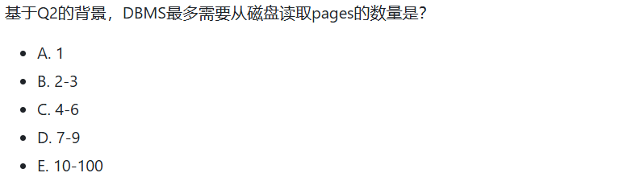

> 杨馥蔓 | 42233047 | 数据科学与大数据技术

---

# WEEK 02

# WEEK 03

# WEEK 04

## - 实验课 | 2025/3/20

# WEEK 05

# WEEK 06

## - CLASS 06 | 2025/4/3  

1.`order by random()` 用法

# WEEK 07

# WEEK 08

## - 实验课 | 2025/4/17

test

# WEEK 09

# WEEK 11

## - 实验课 | 2025/5/8

# WEEK 12 - FastAPI/ER

## - CLASS 12 | 2025/5/15
#E-R

- **实体与联系**

	- **实体：** 现实世界中可区别所有其他对象的一个“事物”或“对象”。实体集（entity set）是相同类型的一个实体集合。
	- **联系：** 多个实体间的相互关联。联系集（relationship set）是相同类型联系的集合。

- **E-R图**  

	- **实体集：** 矩形框表示，实体名在头部，属性名在下面。
	- **联系集：** 连接一对相关实体集的菱形，联系名放在菱形内部。

# WEEK 13&14 - ER/NORM

## - CLASS 13&14 | 2025/5/22-2025/5/29
#BCNF
- **第一范式（1NF）**

	- 数据库的`范式设计越高阶，冗余度就越低`，同时高阶的范式一定符合低阶范式的要求，满足最低要求的范式是第一范式（1NF）。在第一范式的基础上进一步满足更多规范要求的称为第二范式（2NF），其余范式以次类推。
	- 不满足第一范式 （1NF）的数据库就不是关系数据库。
	- 对于一般数据库设 计，都是在3NF和BCNF之间选择。

- **Boyce-Codd范式（BCNF）**

	- 具有函数依赖集$F$的关系模式$R$属于BCNF的条件是，对 $F^+$  中所有形如$α→β$的函数依赖，下面至少一个成立：
		- $α→β$是平凡的函数依赖 
		- $α$是$R$的一个超码
	- BCNF消除所有基于函数依赖能够发现的冗余。
	
	> **函数依赖：** 考虑一个关系模式$r(R)$，令$α∈R$且$β∈R$。 给定$r(R)$的一个实例，我们说这个实例满足（satisfy）函数依 赖$α→β$的条件是：对实例中的所有元组对$t1$和$t2$，若 $t1[α]=t2[α]$，那么$t1[β]=t2[β]$。
	> **平凡依赖：**  如果 $β⊆α$ ，那么函数依赖 $α→β$就是平凡的（trivial）

- **检查非平凡依赖是否违反BCNF**
	- 对于每个非平凡依赖$α→β$，计算属性集$α$的闭包，验证它 是否包含所有$R$的属性；如果是，表明它就是超码。
	- *思路：*找到R的某个非平凡函数依赖$α→β$，$α$的闭包没 有包含所有的属性，那么可以初步分解为： 
		- $R−β$ 
		- $(α,β)$

## HOMEWORK 08 | 2025/5/30 
#E-R    #关系模式 #BCNF 

- **多值属性**

- **E-R图转化成关系模式**


- **BCNF分解** 
	 1) 分析候选码（能推出所有属性）
	 2) 检查给出的函数依赖是否满足BCNF（即左边是超码）
	 3) 利用违反BCNF的函数依赖对R进行分解，直到所有分解均满足BCNF
	


# WEEK 15 - THEORY
#存储 #索引 #查询 #事务
## - CLASS 15 | 2025/6/5

- [测试题-存储/索引](https://github.com/ChenZhongPu/db-swufe/tree/master/12_theory)
> 考虑一个数据库有单个关系`E(play_id, games_played, room_id, total_points)`，其中`play_id`是主码，所有属性均是固定宽度。假设`E`有20,000个元组，并存储在100个pages中。忽略关系的其他额外存储空间，如_page header_和_tuple header_，并有如下假设：
> - DMBS没有任何meta-data。
> - `E`没有任何索引。
> - `E`没有任何页面在内存，并且DBMS能够在内存中存储无限数量的pages。
> - `E`中元组的顺序是随机的（即堆存储）。

 1. Q1

	

> D. 81-100
> - 关系E没有任何索引，DBMS无法通过索引快速定位到满足条件的元组。因此，DBMS必须对整个表进行**全表扫描**。在行式存储中，全表扫描意味着DBMS需要读取包含关系E所有数据的每一个数据页，以便逐个检查每个元组是否满足 `WHERE` 子句的条件。
> - 关系E存储在**100个pages**中。因此，为了执行全表扫描，DBMS需要从磁盘读取所有这100个pages。

2. Q2

	

> A. 1
> - 行式存储，访问一条记录就可以同时拿到 `total_points`, `games_played`, `room_id` ，不需要额外读取其它页。
> - 最理想的情况：这3行数据都恰好存储在同一个页面中，那么最少读取 1 个 page即可满足查询

3. Q3

	

> E. 10-100


- 思考题
	> 稀疏索引能否为非聚集索引？
	```
		不能。
		非聚集索引的数据是无序的，要根据索引值直接定位对应的具体行，而稀疏索引不能精确定位每条记录。
	```
	
	> 索引一定能提高查询性能吗？考虑下面的场景：用户关系中有 `gender`字段，并基于`gender`建立了索引，假设男女比例大致 1:1。那么在查询`SELECT nameFROMgender= 'M'`时，性能如何？
	
	```
		
	```


