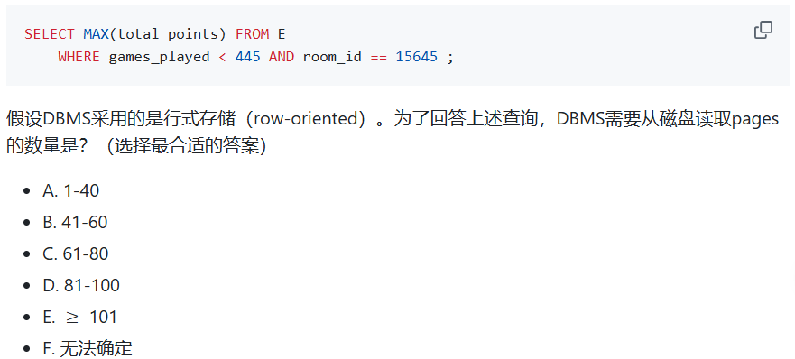
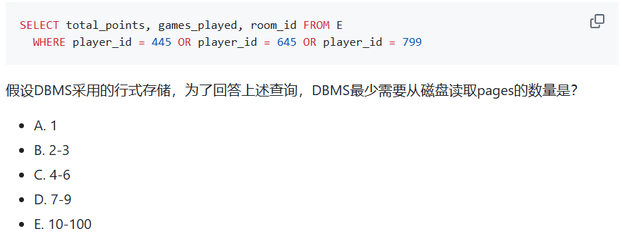

# NOTE_DATABASE

> 杨馥蔓 | 42233047 | 数据科学与大数据技术

---
## 目录
- [课程&作业总结笔记](#课程&作业总结笔记)
- [课程学习思考感悟](#课程学习思考感悟)

# 课程&作业总结笔记
## WEEK 02 | Relational model
 - [x] `Target：key；理解和会写关系代数；` 

**- 核心内容 | CLASS 02 | 2025/3/6**

- 关系- 元组 (tuple) & 属性 (attribute)   ~~ 表- 行&列
- schema
- **key：** super key、candidate key、<u>primary key</u>、foreign key
- **关系代数：**
	- `select` $\sigma$  （对**行**截取，水平）
	- `project` $\Pi$  （对**列**截取，垂直，可以在属性上进行简单计算）
	- `join` $\Join$ , `natural join`（相同名称的属性值相等）
	- 笛卡尔积，谓词 (><=≥≤≠)，逻辑词 ($\land\vee\neg$)

**- 作业总结 | HW 01 | 2025/3/9**

- 写关系代数的小 Tip： 先看题干的句子成分，定语为 select 的内容，宾语为 project 的对象。

## WEEK 03 | Basic SQL
- [x] `Target：学会定义关系（首先要掌握各种数据类型）；select from where基础用法；`

**- 核心内容 | CLASS 03 | 2025/3/13**
- **定义关系**：

	```sql
	CREATE TABLE r;
	--- 包含属性名、数据类型、完整性约束(如 `not null`, `primary key`等)
	DROP TABLE r; --- 删除表
	DELETE FROM r; --- 删除表数据
	```

- **数据类型：** `int`、`numeric(p,d)`、`decima(M,N)`、`float(n)`... | `char(n)`、`varchar(n)`、`text` | `null`
	- `numeric(p,d)`： 最多有 p 位数字，小数点右边 d 位。即整数位有 (p-d) 位。`e.g. numeric(3,1) 可以表示31.4，不能表示314.0`
	- **`null`：** 1) 可能存在但未知 (unknown)；2) 可能不存在
- 基本查询结构： **select，from，where**
- **SQL 附加操作 1：** 

	```sql
	SELECT DISTINCT 
	!=
	BETWEEN a AND b  --- ~~~ `[a,b]`
	old_name AS new_name --- 更名 
	SELECT *
	ORDER BY x ASC, y DESC`
	```

- **注意事项：**
	- 字符串使用**单引号 `''`**
	- 用分号 `;` 结尾，全部使用英文半角字符

## WEEK 04 | Lab
- [x] `Target：掌握SQL附加操作1&2；CASE表达式；psql基础操作；`

**- 核心内容 | 实验课 01 | 2025/3/20**

- **SQL 附加操作 2：**
	- 引号：单引号用两个单引号表示，双引号不变
	- 字符串函数：lower, upper, trim, length
	- **模糊查询：** `LIKE 'a%'`  / `LIKE 'ab_'` (%匹配字符串，_ 匹配字符)
	- 值拼接： pg 使用 `||`   `e.g. SELECT col1 || 'txt' || col2`  --> `{col1} txt {col2}`
- SQL 集合操作： 并\交\差 `() INTERSECT\UNION\EXCEPT ()`
- **CASE 表达式：** 

	```sql
	CASE 
		WHEN condition1 THEN result1 
		WHEN condition2 THEN result2 
		ELSE result 
	END;
	
	--- e.g.
	SELECT ID, ---> *这里有一个逗号 ,
		CASE 
			WHEN score < 60 THEN'C' 
			WHEN score >= 80 THEN'A' 
			ELSE'B' 
		END 
	FROM marks;
	```

**- 作业总结 | HW 03 | 2025/3/26**

- **psql 基础命令：**

	```sql
	\c database_name  --- 连接到数据库database_name
	\l --- 列出所有数据库
	\dt --- 列出当前数据库的所有表
	\d table_name --- 显示table_name的关系模式
	```

## WEEK 05 | null & aggregate
- [x] `Target：难点null；聚集函数；聚集函数 & HAVING & GROUP BY & WHERE；嵌套子查询`

```txt
如果大一Excel函数学的很好，那么我觉得SQL聚集函数的基础部分也会很好理解，非常相似。

对HAVING & GROUP BY & WHERE用法的理解：
where是第一优先级，对一整块数据进行筛选，然后再执行group by，
having是对group by之后的每一小块数据进行筛选。
```

```markdown
上课没听懂null，老师好像在说绕口令，unknown和null在脑子里打架。
课后问了ai，下面内容是在deepseek的帮助下进行的总结。
我认为核心就是理解null可以是 unknown，可能为真可能为假，所以作比较时结果也是unknown，因此返回null。
```

> **NULL**
> - **概念：** 未知或缺失的值。
> 	- 未知的值 unknown（值存在但我们不知道是什么）
> 	- 缺失的值（应该有值但尚未提供）
> - **性质：**
> 	- **与 `NULL` 的比较操作都会返回 `NULL`**（既不是 `TRUE` 也不是 `FALSE`）。
> 	- `NULL` 不能使用= ! = <>来判断，**必须使用 `IS NULL` 或 `IS NOT NULL`**
> 		
> 		```sql
> 		SELECT 1 IS NULL;  -- 结果是 0（FALSE）
> 		SELECT NULL IS NULL;  -- 结果是 1（TRUE）
> 		```
> 	- `NULL` 不是 0，也不是空字符串 ''
> 	- `NULL` 的逻辑运算（见下面核心内容笔记）
> 	- **大多数聚合函数忽略 NULL 值。** (除了 COUNT ( * ))
> 	


**- 核心内容 | CLASS 05 | 2025/3/27**
- **null：** 
	- 算数表达式的任一输入为空，则算数表达式的结果为空。
	- **sql 中会将 unknown 表示为 null**
	- **false 和 unknown 的结果均不会出现在查询结果中。**
	- null 的逻辑运算：与 unknown 一致。**任何与 unknown 的运算，除了被确定的情况，** 如 `false AND unknown = false` 或 `true OR unknown = true`，**其他的结果通常会传播 unknown。**
	- null 与 distinct：多个 null 会被视作相同值，distinct 后只保留一个 null
	> **`COALESCE(expression1, expression2,...)`**：返回表达式中第一个非空值，若所有参数均为 null，则返回 null。如：`SELECT COALESCE(NULL,NULL,3,4,5) FROM dual ---> 3` <br>
	> -用途：处理 null，用默认值替代未知，直接返回一个可操作的非 null 值，类似于 CASE 表达式。
	> ```sql
	> SELECT name, coalesce (salary, 0)  --- coalesce (salary, 'NA')
	> FROM instructor;
	> ```
- 聚集函数：
	- avg\sum\count\min\max，只有count 能和 * 连用
	- 聚集函数不能直接出现在 WHERE，WHERE 子句中的谓词是在聚集之前起作用
	- group by：按一个或多个属性进行分组
	- **having：对分组限定条件，不能用 where 子句**
	- 出现在 select 和 having 子句中但没有被聚集的属性只能是出现在 group by 子句中的那些属性！
	> 
	><u> Q：如何理解执行次序？</u>
	> 
	> ```sql
	> SELECT some_attr 
	> FROM some_rel 
	> WHERE where_cond 
	> GROUP BY group_attr 
	> HAVING having_cond;
	> ```
	> 
	> 1. 最先根据 from 子句计算出一个关系 
	> 2. 如果有 where，将 where 的谓词应用到上述关系 
	> 3. 如果有 group by，在上述结果的基础上形成分组。如果没有，相当于整个元组集被当作一个分组 
	> 4. 如果出现 having，将应用到每个分组；不满足 having 的谓词的分组将被抛弃
	> 5. select 利用剩下的分组产生查询结果中的元组
- 嵌套子查询 1： [**(select-from-where) 嵌套在另一个查询中)**]
	- `from ()`、 `IN ()` 、`> some() ` 至少比某一个大，like“大于最小值” （'= some' 等价于 in；'any'等价于some，但建议用some）、` > all() ` 比所有大 （'<> all' 等价于 not in）
	> Python 中的 `any ()`:
	> - 用于判断给定的可迭代参数 iterable 是否全部为 False，则返回 False，如果有一个为 True，则返回 True。
	> - 元素除了是 0、空、FALSE 外都算 TRUE。

**- 作业总结 | HW 04 | 2025/3/29**
- **`HAVING` 子句只能包含：**
	- **分组列**（`GROUP BY` 后面的列，如 `x`）。但是不推荐，比 `WHERE` 子句性能差。
	- **聚合函数**（如 `SUM(y)`,  `COUNT(*)` 等）
- where 中不能用聚合函数。

## WEEK 06 | aggregate
- [x] `Target：嵌套子查询；EXISTS；WITH；CASE；`

```
比上周的内容要复杂，要多实践才能较好掌握，光看概念觉得很easy，但是一结合起来写代码就暴露出各种各样的问题。。要先记住每个子句的基本格式，不然写的时候脑子会很混乱。ai的作用在于能告诉我为什么会在这里卡住，有哪些知识点没有理解到位。
```

**- 核心内容 | CLASS 06 | 2025/4/3** 
- limit，`SELECT * FROM student FETCH FIRST 5 ROWS ONLY;`
- `order by random()` 含义：随机抽取 5 条记录。
	- **`random()` 函数**：为表中的每一行生成一个随机数。
	- **`ORDER BY random()`**：根据每行生成的随机数对整个结果集进行排序。
	- `LIMIT 5`：从随机排序后的结果中取出前 5 条记录。
- 嵌套子查询 2：
	- 标量子查询，相关子查询
	- exists：测试子查询返回的关系是否为空。记录多时比 in 好用。
	- with：定义一个临时的关系，用于当前查询。
	>  <u>Q：如果有工资超过 40000 的教师，输出 YES，否则输出 NO</u>
	>  
	>  ```sql
	> --- exists
	> SELECT
	> 	CASE　
	> 		WHEN EXISTS (
	> 			SELECT 1 FROM instructor 
	> 			WHERE salary > 40000 )
	> 		THEN 'YES'
	> 		ELSE 'NO'
	> 	END AS has_high_salary;
	> --- (FROM instructor;) 
	> ---不需要。`CASE WHEN EXISTS(...)` 本身就是一个完整的表达式，`EXISTS` 子查询已经包含了它需要的数据源（`FROM instructor`），外层SELECT不需要再指定数据源。
	> 
	> --- max
	> SELECT
	> 	CASE 
	> 		WHEN (SELECT MAX (salary) FROM instructor) >4000
	> 		THEN 'YES'
	> 		ELSE 'NO'
	> 	END AS has_high_salary;
	> ```


## WEEK 07 | Change

- [x] `Target：增删改；`

**- 核心内容 | CLASS 07 | 2025/4/10** 

- 增删改：

	```sql
	--- 1. 删
	DELETE FROM r 
	WHERE p;
	---- DELETE FROM r & DROP TABLE r：
	---- 前者只删除表中所有数据行，保留表结构；后者删除整个表。
	---- 生产实践中一般并不会真的删除数据，而是将其设置为「不可见」
	
	--- 2. 插入
	```


**- 作业总结 | HW 05 | 2025/4/11**

## WEEK 08

### - 实验课 | 2025/4/17

test

## WEEK 09

## WEEK 11

### - 实验课 | 2025/5/8

## WEEK 12 - FastAPI/ER

### - CLASS 12 | 2025/5/15


## WEEK 13&14 - ER/NORM

```
这里开始听不懂。。。在 chatgpt 的帮助下学会了怎么进行 BCNF 分解，但是还不是很理解理论。
```

 **- 核心内容 | CLASS 13&14 | 2025/5/22-2025/5/29**
- **第一范式（1 NF）**

	- 数据库的 `范式设计越高阶，冗余度就越低`，同时高阶的范式一定符合低阶范式的要求，满足最低要求的范式是第一范式（1 NF）。在第一范式的基础上进一步满足更多规范要求的称为第二范式（2 NF），其余范式以次类推。
	- 不满足第一范式 （1 NF）的数据库就不是关系数据库。
	- 对于一般数据库设 计，都是在 3 NF 和 BCNF 之间选择。

- **Boyce-Codd 范式（BCNF）**

	- 具有函数依赖集 $F$ 的关系模式 $R$ 属于 BCNF 的条件是，对 $F^+$  中所有形如 $α→β$ 的函数依赖，下面至少一个成立：
		- $α→β$ 是平凡的函数依赖 
		- $α$ 是 $R$ 的一个超码
	- BCNF 消除所有基于函数依赖能够发现的冗余。
	
	> **函数依赖：** 考虑一个关系模式 $r(R)$，令 $α∈R$ 且 $β∈R$。 给定 $r(R)$ 的一个实例，我们说这个实例满足（satisfy）函数依 赖 $α→β$ 的条件是：对实例中的所有元组对 $t1$ 和 $t2$，若 $t1[α]=t2[α]$，那么 $t1[β]=t2[β]$。
	> 
	> **平凡依赖：**  如果 $β⊆α$ ，那么函数依赖 $α→β$ 就是平凡的（trivial）

- **检查非平凡依赖是否违反 BCNF**
	- 对于每个非平凡依赖 $α→β$，计算属性集 $α$ 的闭包，验证它 是否包含所有 $R$ 的属性；如果是，表明它就是超码。
	- *思路：*找到 R 的某个非平凡函数依赖 $α→β$，$α$ 的闭包没有包含所有的属性，那么可以初步分解为： 
		- $R−β$ 
		- $(α,β)$

**- 作业总结 | HW 08 | 2025/5/30** 
- **E-R 图绘制**  
	- **实体集：** 矩形框表示，实体名在头部，属性名在下面。
	- **联系集：** 连接一对相关实体集的菱形，联系名放在菱形内部。
- **BCNF 分解** 
	 1) 分析候选码（能推出所有属性）
	 2) 检查给出的函数依赖是否满足 BCNF（即左边是超码）
	 3) 利用违反 BCNF 的函数依赖对 R 进行分解，直到所有分解均满足 BCNF


## WEEK 15 - THEORY
### - CLASS 15 | 2025/6/5

- [测试题-存储/索引](https://github.com/ChenZhongPu/db-swufe/tree/master/12_theory)
> 考虑一个数据库有单个关系 `E(play_id, games_played, room_id, total_points)`，其中 `play_id` 是主码，所有属性均是固定宽度。假设 `E` 有 20,000 个元组，并存储在 100 个 pages 中。忽略关系的其他额外存储空间，如_page header_和_tuple header_，并有如下假设：
> - DMBS 没有任何 meta-data。
> - `E` 没有任何索引。
> - `E` 没有任何页面在内存，并且 DBMS 能够在内存中存储无限数量的 pages。
> - `E` 中元组的顺序是随机的（即堆存储）。

 - 1. Q 1

	

	<u> D. 81-100</u>
	 
	关系 E 没有任何索引，DBMS 无法通过索引快速定位到满足条件的元组。因此，DBMS 必须对整个表进行**全表扫描**。在行式存储中，全表扫描意味着 DBMS 需要读取包含关系 E 所有数据的每一个数据页，以便逐个检查每个元组是否满足 `WHERE` 子句的条件。<br>
	而关系 E 存储在**100 个 pages**中。因此，为了执行全表扫描，DBMS 需要从磁盘读取所有这 100 个 pages。

<br>

- 2. Q 2

	

	<u>A. 1</u>
	
	行式存储：访问一条记录就可以同时拿到 `total_points`, `games_played`, `room_id` ，不需要额外读取其它页。<br>
	最理想的情况：这 3 行数据都恰好存储在同一个页面中，那么最少读取 1 个 page 即可满足查询

<br>

- 思考题
	> 稀疏索引能否为非聚集索引？
	```
		不能。
		非聚集索引的数据是无序的，要根据索引值直接定位对应的具体行，而稀疏索引不能精确定位每条记录。
	```


# 课程学习思考感悟
- 学习数据库的过程中，老师经常就 SQL 和 Python 语言之间的区别和联系进行提问，事实上我现在对 SQL 的掌握与了解可以说是远大于 Python（因为还没有系统学习过 Python），那么未来我在自行学习 Python 的过程中，也可以多多反向思考与它与 SQL 的区别。
- 总的说来，我更擅长根据课程范围内的要求写出代码，但学习到后面的理论部分，我就感觉非常非常难以理解。所以正如笔记所现，后面几周的笔记好像在抄书，还没有内化成自己的知识。感觉需要多学习一些计算机的知识，才能帮助我更精进数据库。


