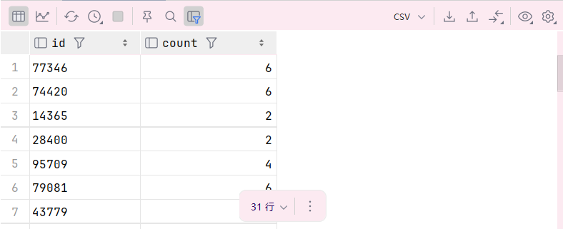
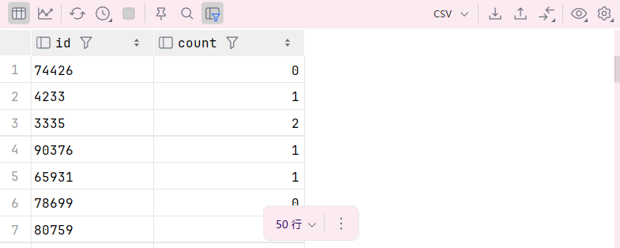
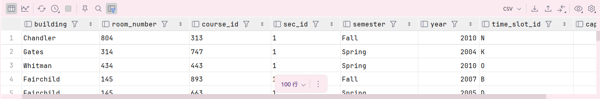
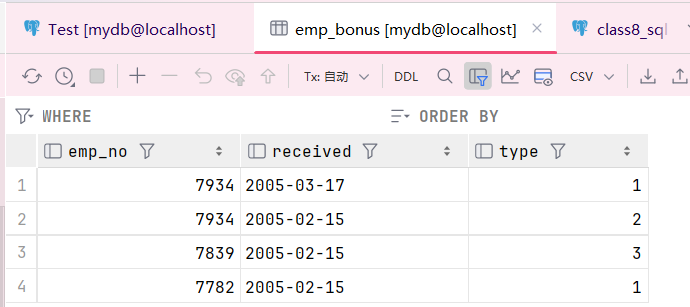

> **杨馥蔓 | 42233047**

---
## 1. 大学数据库
>1. 展示每个教师（ `instructor`）的工号及其授课课程段（`section`）的数量。如果仅仅考虑授课的老师，请使用单表查询完成。

```sql
SELECT id, COUNT(*)  
FROM teaches  
GROUP BY id ;
```



>2. 对于第 1 题，请确保即使没有授课的教师也要被输出。使用JOIN 完成。
```sql
SELECT instructor.id, COUNT(sec_id)  
FROM instructor  
LEFT JOIN teaches  
ON instructor.id = teaches.id  
GROUP BY instructor.id ;
```



>3. 请使用标量子查询（scalar subquery）完成第 2 题。

```sql
SELECT instructor.ID ,  
    (SELECT COUNT(sec_id)  
     FROM teaches  
     WHERE teaches.ID = instructor.ID)  
FROM instructor;
```


>4.解释为什么在 `from` 子句中追加 `natural join section` 并不会影响结果。

```sql
select course id, semester, year, sec id, avg (tot cred) 
from takes natural join student 
where year = 2017 
group by course id, semester, year, sec id 
having count (ID) >= 2;
```

**原因：** 
1. `takes` 表已经包含了所有必要的信息（`course_id`, `sec_id`, `semester`, `year`），`section` 表中的信息对分组和聚合计算没有额外贡献。
2. 自然连接没有引入新的分组或过滤条件。
因此，即使追加了 `NATURAL JOIN section`，查询结果也不会发生改变。

>5.使用 `using` 重写下面的查询：

```sql
select * 
from section natural join classroom;
```

```sql
select *  
from section inner join classroom  
using(building, room_number);
```



`运行结果均为100行`

## 2. 应用题
>1. 创建两个关系，并添加测试数据，其中 emp_bonus 的内容严格按表所示。

a.  创建关系

```sql
CREATE TABLE emp_bonus(  
    emp_no INT,  
    received DATE,  
    type INT  
);  
  
CREATE TABLE emp(  
    emp_no INT PRIMARY KEY ,  
    ename VARCHAR(50),  
    sal DECIMAL(10,2),  
    dept_no INT  
);
```

b.添加测试数据

```sql
--- 添加 emp_bonus 数据
INSERT INTO emp_bonus (emp_no, received, type) VALUES  
(7934, TO_DATE('17-MAR-2005', 'DD-MON-YYYY'), 1),  
(7934, TO_DATE('15-FEB-2005', 'DD-MON-YYYY'), 2),  
(7839, TO_DATE('15-FEB-2005', 'DD-MON-YYYY'), 3),  
(7782, TO_DATE('15-FEB-2005', 'DD-MON-YYYY'), 1);

--- 添加 emp 数据
INSERT INTO emp (emp_no, ename, sal, dept_no) VALUES  
(7934, 'ALICE', 4000.00, 42),  
(7839, 'BOD', 7000.00, 42),  
(7782, 'CINDY', 10000.00, 42);
```



>2. 请列出部门编号为42 的所有员工的总工资及其总奖金。

```sql
SELECT  
    (SELECT SUM(sal)  
     FROM emp  
     WHERE dept_no = 42) AS total_salary, --- 计算总工资  
    (SELECT SUM(emp.sal *  
           CASE emp_bonus.type  
               WHEN 1 THEN 0.10  
               WHEN 2 THEN 0.20  
               WHEN 3 THEN 0.30  
           END)  
     FROM emp  
     JOIN emp_bonus  
     USING(emp_no)  
     WHERE emp.dept_no = 42) AS total_bonus; --- 计算总奖金
```


