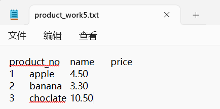
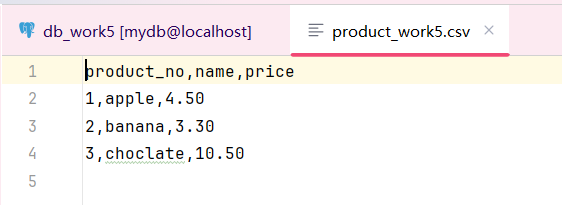

** 杨馥蔓 | 42233047 **


---

>考虑关系模式`product(product_no, name, price)`，完成下面的题目：
## 题目一
> 在数据库中创建该关系，并自建上面关系的txt数据文件：
> 
> 1. 使用`COPY`命令导入数据库（PostgreSQL）。
> 2. 将该关系导出为任意文件（如SQL、Txt、CSV、JSON等）。

- **创建关系**
```sql
--- 创建关系  
CREATE TABLE product(  
    product_no INT PRIMARY KEY,  
    name VARCHAR(10),  
    price DECIMAL(10,2)  
);
```
- **创建txt数据文件**

- **使用COPY命令导入数据库**  
```sql
--- 使用COPY命令导入数据库  
COPY product FROM 'D:\Zfufupaofile\DDatagrip\Class_database\product_work5.txt'
DELIMITER E'\t' HEADER; 
``` 
- **将 product 表数据导出为 CSV 文件**
```sql
--- 将 product 表数据导出为 CSV 文件  
COPY product TO 'D:\Zfufupaofile\DDatagrip\Class_database\product_work5.csv' 
WITH (FORMAT CSV, HEADER);
```

## 题目二

> 1. 添加一个新的商品，编号为`666`，名字为`cake`，价格不详。
> 2. 使用一条SQL语句同时添加3个商品，内容自拟。
> 3. 将商品价格统一打8折。
> 4. 将价格大于100的商品上涨2%，其余上涨4%。
> 5. 将名字包含`cake`的商品删除。
> 6. 将价格高于平均价格的商品删除。

```sql
--- 添加一个新的商品，编号为666，名字为cake，价格不详。  
INSERT INTO product(product_no, name, price)  
VALUES (666, 'cake', NULL);  

--- 使用一条SQL语句同时添加3个商品，内容自拟。  
INSERT INTO product (product_no, name, price)  
VALUES (667, 'Milk', 3.5), (668, 'Bread', 4.0), (669, 'Eggs', 5.2);  

--- 将商品价格统一打8折。  
UPDATE product  
SET price = price * 0.8;  

--- 将价格大于100的商品上涨2%，其余上涨4%。  
UPDATE product  
SET price = price *  
    CASE  
        WHEN price > 100 THEN 1.02  
        ELSE 1.04  
    END;  

--- 将名字包含cake的商品删除。  
DELETE FROM product  
WHERE name LIKE '%cake%';  

--- 将价格高于平均价格的商品删除。  
DELETE FROM product  
WHERE price > (SELECT AVG(price) FROM product);
```

<div STYLE="page-break-after: always;"></div>

## 题目三

> 针对PostgreSQL
> 使用参考下面的语句添加10万条商品，
```sql
-- PostgreSQL Only
INSERT INTO product (name, price)
SELECT
    'Product' || generate_series, -- 生成名称 Product1, Product2, ...
    ROUND((random() * 1000)::numeric, 2) -- 生成0到1000之间的随机价格，保留2位小数
FROM generate_series(1, 100000);
```
>比较`DELETE`和`TRUNCATE`的性能差异。

**针对PostgreSQL比较差异：**
- **实验代码**
```sql
--- 比较`DELETE`和`TRUNCATE`的性能差异。

--- 创建关系 product(name, price)
CREATE TABLE product(  
    name VARCHAR(10),  
    price DECIMAL(10,2)  
);  

--- 插入100000条数据  
INSERT INTO product (name, price)  
SELECT  
    'Product' || generate_series, -- 生成名称 Product1, Product2, ...    ROUND((random() * 1000)::numeric, 2) -- 生成0到1000之间的随机价格，保留2位小数  
FROM generate_series(1, 100000);
  
--- `DELETE`  
DELETE FROM product;  

--- `TRUNCATE`  
TRUNCATE TABLE product;
```

<div STYLE="page-break-after: always;"></div>

- **实验结果**
```sql
mydb.public> DELETE FROM product
[2025-04-10 20:47:43] 100 ms 中有 100,000 行受到影响
```

```sql
mydb.public> TRUNCATE TABLE product
[2025-04-10 20:55:11] 在 10 ms 内完成
```
- **实验结论：**
处理同样量级的数据，`DELETE`和`TRUNCATE`相比，`DELETE`用了100ms，而`TRUNCATE`只用了10ms，`TRUNCATE`处理速度更快，性能更好。
- **原理分析：**

	| `DELETE` | `TRUNCATE` |
	| :---: | :---: |
	| DML（逐行删除） | DDL（一次性删除数据页）|
	| 触发行级约束器 | 不触发 |
	| 记录每一行的删除操作 | 仅记录数据页释放操作|
	| 速度慢 | 速度快|


