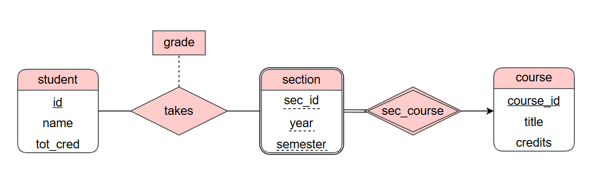

> **杨馥蔓 | 42233047**

---

# 题目一

>考虑一个用于记录学生（student）在不同课程段（section）在不同考试中取得成绩（grade）的数据库，其中课程段属于某个课程（course）。
> 1. 绘制E-R图，只用二元联系。确保能够表示一个学生在不同考试中获得的成绩，且一个课程段可能有多次考试。（提示：使用多值属性）
> 2. 写出上面E-R图的关系模式（要求注明主码）。

- 绘制E-R图

- 写出E-R图的关系模式

	- student(<u>id</u>, name, tot_cred)
	- takes(<u>id</u>, <u>course_id</u>, <u>sec_id</u>, <u>semester</u>, <u>year</u>, grade)
	- section(<u>course_id</u>, <u>sec_id</u>, <u>yesr</u>, <u>semester</u>)
	- course(<u>course_id</u>, title, credits)

# 题目二
> 如果一个关系模式中只有两个属性，证明该关系模式必定属于BCNF。

**Proof:** 
- 设关系模式为R(A,B)
1. 若函数依赖为 A→B：
	- 因为A→B，所以A可以推出所有属性，A为候选码。
	- 又A在左侧，A是超码，则A→B满足BCNF。
2. 同理，若函数依赖为 B→A，则B→A满足BCNF。
3. 若函数依赖为 A→B且B→A，A和B互为候选码，任一非平凡依赖的左边都是候选码，满足BCNF。
4. 若函数依赖为A→A、B→B，没有非平凡的函数依赖，满足BCNF。
- **综上**，如果一个关系模式中只有两个属性，则该关系模式必定属于BCNF。

# 题目三
> 考虑关系模式`r(A, B, C, D, E)`，有如下函数依赖：
> 
> -  A → BC
> -  BC → E
> -  CD → AB
> 
> 请给出一个满足BCNF的分解，并说明你的分解符合BCNF。

- **Step 1: 找到候选码**
	- 由于CD→AB，而A→BC，BC→E，所以CD→ABCDE，即**CD是候选码**
- **Step 2: 检查是否满足BCNF**（左边是否是超码）
	- 因为A和BC的闭包都不包含所有属性ABCDE，所以不是超码，**A→BC和BC→E违反BCNF**。
	- 因为CD是超码，所以**CD→AB满足BCNF**
- **Step 3: BCNF分解**
	- a. 选择	A→BC分解R
	- 1. 分解R1(A, B, C)
		- 因为A是候选码，所以A→BC满足BCNF
	- 2. 分解R2(A, D, E)
		- 因为A→BC，BC→E，所以A→ E，但A无法推出D，不是候选码，所以A→E违反BCNF
		- b. 选择A→E分解R2
		- 1. 分解R3(A, E)
			- 候选码是 A,所以A→E满足BCNF
		- 2. 分解R4(A, D)
			- 无非平凡函数依赖，满足BCNF

- **分解结果：**

- R1​(A,B,C)，R3(A, E)，R4(A, D)，由上述步骤可知，分解符合BCNF。

