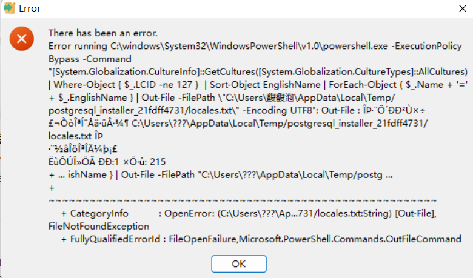
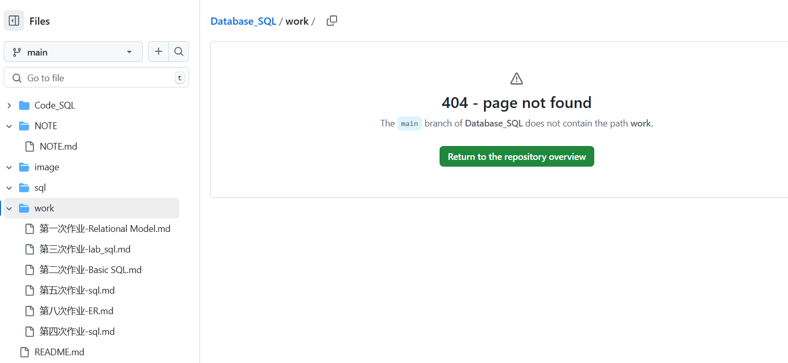

# ✨ 自我评价-数据库原理与应用


## 📑 目录

- [👤 简介](#-简介)
- [📝 课堂/作业笔记-数据库](#-课堂作业笔记-数据库)
- [📂 作业/测验/期末报告](#-作业测验期末报告)
- [💻 代码记录](#-代码记录)
- [🔍 探索](#-探索)
  - [1. 安装Postgresql软件遇到问题 | 2025/3/2](#1-安装postgresql软件遇到问题--202532)
  - [2. 学习使用FastAPI | 2025/5/18 - 2025/6/-](#2-学习使用fastapi--2025518--20256-)
  - [3. Git 操作教程(总结于ChatGPT) | 2025/5/30](#3-git-操作教程总结于chatgpt--2025530)
  - [📚 4. ELSE](#4-else)
- [📊 打分依据 (40')](#-打分依据-40)
- [💬 其他](#-其他)

## 👤 简介

> - **杨馥蔓 | 42233047 | 数据科学与大数据技术**
>
> - GitHub: [Fufupao](https://github.com/Fufupao)


## 📝 课堂/作业笔记-数据库

- [NOTE](https://github.com/Fufupao/Database_SQL/blob/5d8bd78a9ce6503a33124d5ad57b5fcdc96232d4/NOTE/NOTE.md)

✍🏻**Notes：** 包含`课堂`、`作业`以及数据库`拓展`笔记

## 📂 作业/测验/期末报告

- 作业/测试 [Work](https://github.com/Fufupao/Database_SQL/tree/main/work)

- 期末报告 [Smart Home API - PDF](

## 💻 代码记录

- 课堂/作业 [Code_SQL](https://github.com/Fufupao/Database_SQL/tree/main/Code_SQL)

- 期末项目 [Smart Home API](https://github.com/Fufupao/Smart-Home-API)

## 🔍 探索

### 1. 安装`Postgresql`软件遇到问题 | 2025/3/2



发现是因为电脑用户名为中文名导致报错
研究了一个下午
使用b站发现了一个不用修改注册表的方法

[bzhan link](

[weiruan link]

### 2. 学习使用`FastAPI` | 2025/5/18 -2025/6/-
> 期末项目导向学习FastAPI


### 3. `Git` 操作教程(总结于Chatgpt ) | 2025/5/30

> GitHub上写Markdown无法实时预览（也可能是我不会..），所以选择用Obsidian写了笔记后用Git同步。

#### a. 上传

- STEP 1 ：（只用在第一次 Git 文件夹时操作）

```bash
# 初始化仓库
# 添加远程仓库地址（使用SSH）
git init 
git remote add origin git@github.com:username/repository.git
## 》替换username；替换repository
```

- STEP 2：添加目标文件到Git 暂存区

```bash
# 添加某个文件夹到 git 暂存区 
git add NOTE 
## 》替换NOTE为自己的文件夹

# 添加文件到 git 暂存区
# git add NOTE/NOTE.md

# 添加全部文件
# git add .
```

- STEP 3：提交更改

```bash
# 提交更改
git commit -m "（说明）"
git push

## 》(首次推送看这里) 
git commit -m "（说明）"
### 推送时创建 main 分支
git branch -M main
git push -u origin main
```

-  完整指令：

```bash
git add filename
git commit -m "（说明）"
git push

# git add NOTE 
# git add NOTE/NOTE.md
# git add .
```

#### b. 克隆

```bash
## 使用SSH
git clone git@github.com:username/repository.git
```

#### c. 拉取到本地

如果远程仓库已有内容，第一次上传时会报错:

> ```bash
> To github.com:Fufupao/Database_SQL.git ! [rejected] main -> main (fetch first) error: failed to push some refs to 'github.com:--/--.git' hint: Updates were rejected because the remote contains work that you do not hint: have locally. This is usually caused by another repository pushing to hint: the same ref. If you want to integrate the remote changes, use hint: 'git pull' before pushing again. hint: See the 'Note about fast-forwards' in 'git push --help' for details.
> ```
>这表示：
> >远程仓库有内容（比如 GitHub 上自带的 README.md），你本地仓库没有同步这些内容，Git 为了避免覆盖远程文件，拒绝直接推送。

```bash
# 使用命令：
git pull origin main --allow-unrelated-histories

# 解决冲突后重新上传
git add .
git commit -m "Resolve merge conflicts"

```

**! !如果远程仓库已经有内容，建议先拉取并合并!!**

---

#### 小插曲（警醒...
哈哈 以为push force NOTE文件夹是只强制清空NOTE文件夹，第一次推送没有提前pull到本地 我的GitHub仓库清空了！！
如何呢。。。重新再来
**一定要养成好习惯**
<合影留念>



---

### 4. ELSE
- 学会使用GitHub
- 学会Markdown语法

## 📊 打分依据 (`40'`)

| 项目             | 满分 | 得分 | 备注 |
|:------------------:|:------:|:------:|:------|
| 笔记 / 课堂表现   | 15   | 13   | 扣分原因：<br>1. 笔记部分内容可进一步归纳提升；<br>2. 有些概念很抽象，上课过程中偶尔会走神。 |
| 作业 / 测验 / 项目 | 10   | 10   | 全部完成 |
| 代码       | 3    | 3    | 全部完成 |
| 探索           | 12   | 12   | 学习修改电脑用户名、学习 FastAPI、掌握 Git / GitHub 基础操作、Markdow语法等。 |
| **总分**          | 40 | **38** | **--> 自评得分：40 分** |

- 由于本学期正在准备考研，还用心完成了课程所有内容并学到了非常有用的知识，在未来求职过程中也许会派上用场，所以我决定为自己的勤劳付出给予满分**40分**！

## 💬 其他
- 老师上课很用心，虽然经常点同学回答问题，但运气和选座位技巧使然，让我只被点到过两次。虽然只有两次，可我感觉好像被提问的知识点会记得更牢固。PS：我很喜欢老师抽人回答问题，请老师对待以后的学生也保持优良传统哈哈哈。
- 老师下课也积极回答我们的问题，虽然不是我向老师提的问，但是为我们组在其他课程上的风格迁移网站建立提供了很大的帮助。
- 认真完成期中测试也让老师记住了我的名字，我非常开心，谢谢小普老师😊👸🏻。


